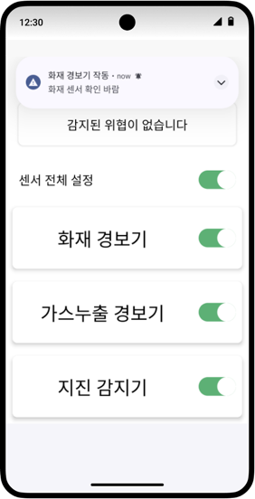
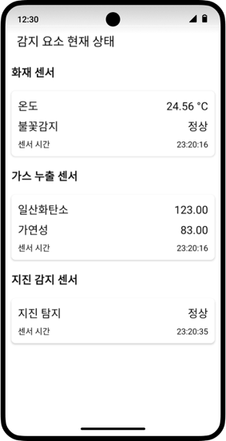

# 스마트 빌딩 알림 시스템 - SBAS

> **Smart Building Alarm System**  
> 아두이노 기반 센서와 안드로이드 앱을 활용한 **실시간 재난 탐지 & 알림 시스템**  
> 온도, 가스 누출, 지진 상황을 감지하고, 사용자에게 즉시 알림을 전송합니다.

---

## 팀 소개

| 이름   | 역할  | GitHub 프로필 |
|------|------|----------------|
| 허준서 | Android  | [Junseo0324](https://github.com/Junseo0324) |
| 박명진 | Arduino  | [Unsept](https://github.com/Unsept) |

---

## 기획 의도

건물 내 재난 상황에서 **빠른 대응**은 안전 확보의 핵심입니다.  
SBAS는 아두이노 센서를 활용해 건물의 상태를 실시간으로 모니터링하고,  
**문제가 발생하면 앱 사용자에게 즉시 알림**을 제공하여  
스마트 빌딩 환경의 안전성을 높이는 것을 목표로 합니다.

---

## 주요 기능

- 실시간 알림: Firebase Cloud Messaging 기반 재난 상황 알림
- 센서 연동: 온도, CO2(가스 누출), 지진 센서 데이터 수집
- 데이터 관리: REST API를 통해 DB(MySQL)에 센서 데이터 저장
- 앱 시각화: Android 앱에서 시간별 센서 데이터 확인

## 기술 스택

| 분류           | 사용 기술 / 도구                                                                        |
|--------------|-----------------------------------------------------------------------------------|
| **개발 언어**    | Kotlin                                                                              |
| **프레임워크**    | Android Studio                                                          |                                                                          |                                                                       |
| **네트워크 통신**  | Retrofit                                          |
| **스토리지**     | SharedPreferences                                                            |                                          |

 

## 서비스 UI
| 메인 | 현재 상태 |
| ------ | ---------- |
|  |  |
